# generate-tests Workflow

Documents the end-to-end flow of the `/generate-tests` skill — from spec file to generated POMs and spec file.

---

## Overview

`/generate-tests` reads a spec file in `docs/specs/`, clarifies ambiguities in one round-trip, explores the live app with MCP browser tools, then writes page object files and a spec file. No manifest is used — file discovery is always live from the filesystem.

---

## Workflow Diagram

```mermaid
flowchart TD
    START(["/generate-tests invoked"])

    %% Step 0a — resolve spec file
    START --> ARG{Explicit\nargument?}
    ARG -->|Yes| READSPEC[Read spec file]
    ARG -->|No| IDE{IDE active file\nunder docs/specs/?}
    IDE -->|Yes| USEIDE[Use IDE active file]
    IDE -->|No| STOP_NOFILE([Stop: ask user to provide path])

    READSPEC --> EXISTS{File exists?}
    EXISTS -->|No| STOP_NOTFOUND([Stop: list available specs])
    EXISTS -->|Yes| PRIOR

    USEIDE --> PRIOR

    %% Step 0b — prior generation check
    PRIOR{Output spec\nalready on disk?}
    PRIOR -->|Yes| REGEN{Ask: Regenerate?}
    PRIOR -->|No| STEP1
    REGEN -->|No| STOP_DONE([Stop])
    REGEN -->|Yes| STEP1

    %% Step 1 — parallel reads
    STEP1["Step 1 — Parallel reads (all simultaneous)
    ─────────────────────────────────
    Read  → spec file
    Read  → docs/pom-templates.md
    Glob  → tests/pages/admin/*.ts
    Glob  → tests/pages/public/*.ts
    Read  → envs/.env"]

    STEP1 --> STEP2

    %% Step 2 — clarify
    STEP2{Overwrites or\nambiguities?}
    STEP2 -->|No| STEP3
    STEP2 -->|Yes| ASK["Ask everything in ONE message
    (max 4 questions)
    Wait for one reply"]
    ASK --> STEP3

    %% Step 3 — resolve pages
    STEP3["Step 3 — Resolve pages
    ─────────────────────────
    Map each test case → URL
    Priority: url: field → known routes → convention
    Deduplicate shared URLs
    Build page list with POM output paths"]

    STEP3 --> STEP4

    %% Step 4 — MCP exploration
    STEP4["Step 4 — MCP exploration"]
    STEP4 --> AUTH{role needs\nauthentication?}
    AUTH -->|No — guest/public| NAVPAGE
    AUTH -->|Yes| LOGIN["Authenticate once
    navigate → /login
    fill Email + Password
    click submit
    verify URL changed"]
    LOGIN --> NAVPAGE

    NAVPAGE["Navigate to each unique URL
    browser_snapshot target: 'main'
    (full-page only for header elements)"]

    NAVPAGE --> ERRCHECK{Error locators\nneeded?}
    ERRCHECK -->|Pattern in existing _*.ts| REUSEPATTERN["Reuse pattern
    flag as uncertain"]
    ERRCHECK -->|New pattern| BROWSERSUBMIT["Explore via browser
    (one browser_fill_form call)"]

    REUSEPATTERN --> STEP5
    BROWSERSUBMIT --> STEP5

    %% Step 5 — write POMs
    STEP5["Step 5 — Write page object files"]
    STEP5 --> BASE["Overwrite _*.ts
    Locators only — no methods
    Extends base class per role"]
    BASE --> EXT{*.ts already\non disk?}
    EXT -->|No| WRITEEXT["Write *.ts
    navigate() + action methods"]
    EXT -->|Yes| SKIPEXT["Skip *.ts
    (manually maintained)"]

    WRITEEXT --> STEP6
    SKIPEXT --> STEP6

    %% Step 6 — write spec
    STEP6["Step 6 — Write spec file
    ────────────────────────────────────
    Path mirrors docs/ under tests/specs/
    Import test/expect from fixtures
    One test.describe, one test() per bullet
    storageState cleared for guest role
    waitForResponse for AJAX actions
    test.skip() for conditional cases"]

    STEP6 --> STEP7

    %% Step 7 — report
    STEP7(["Step 7 — Report
    ✓ new files  ~ overwritten files
    Uncertain selectors listed
    npx playwright test <path>"])

    %% Styling
    classDef stop fill:#ffcccc,stroke:#cc0000,color:#000
    classDef decision fill:#fff3cd,stroke:#856404,color:#000
    classDef process fill:#d1ecf1,stroke:#0c5460,color:#000
    classDef terminal fill:#d4edda,stroke:#155724,color:#000

    class STOP_NOFILE,STOP_NOTFOUND,STOP_DONE stop
    class ARG,IDE,EXISTS,PRIOR,REGEN,STEP2,AUTH,ERRCHECK,EXT decision
    class STEP1,ASK,STEP3,STEP4,NAVPAGE,LOGIN,REUSEPATTERN,BROWSERSUBMIT,STEP5,BASE,WRITEEXT,SKIPEXT,STEP6 process
    class START,STEP7 terminal
```



---

## Step Reference

| Step | Name | Key rule |
|---|---|---|
| 0a | Resolve spec file | argument → IDE active file → stop |
| 0b | Prior generation check | ask before overwriting spec |
| 1 | Parallel reads | all reads fire simultaneously |
| 2 | Confirm & Clarify | one message, max 4 questions, one reply |
| 3 | Resolve pages | url: field → known routes → /Admin/{Entity}/{Action} |
| 4 | MCP exploration | grep existing POMs before browser-testing error states |
| 5 | Write POMs | always overwrite `_*.ts`; never overwrite `*.ts` |
| 6 | Write spec | mirrors docs/ path under tests/specs/ |
| 7 | Report | ✓ new, ~ overwritten, list uncertain selectors |

---

## File Output Structure

```
docs/specs/public/wishlist.md
    │
    ├── tests/pages/public/_WishlistPage.ts    ← always overwritten (locators only)
    ├── tests/pages/public/WishlistPage.ts     ← written once, then protected
    └── tests/specs/public/wishlist.spec.ts    ← always overwritten
```

### POM split pattern

```
_WishlistPage.ts          WishlistPage.ts
─────────────────         ──────────────────────────────
readonly heading          navigate(): Promise<void>
readonly emptyMessage     removeItem(name): Promise<void>
readonly wishlistRows     addAllToCart(): Promise<void>
readonly addToCartButton  clearWishlist(): Promise<void>
  ↑ generated, safe       ↑ manual, never overwritten
    to overwrite
```

---

## Wait Strategy

| Situation | Method |
|---|---|
| Action changes page URL (save, redirect) | `waitForNavigation({ waitUntil: 'domcontentloaded' })` |
| Action triggers AJAX (search, grid refresh, add to cart) | `waitForResponse(resp => resp.url().includes('...'))` |
| Uncertain | `waitForResponse` — works whether or not navigation occurs |

`waitForNetworkIdle()` is banned — this app has persistent background connections that prevent networkidle from ever resolving.

---

## Auth Fixtures

| Spec role | storageState | Fixture |
|---|---|---|
| `admin` | pre-loaded via setup project | `{ authenticatedAdmin }` |
| `buyer` | cleared; login in `beforeEach` | `{ page }` + `publicPage.login()` |
| `public` | cleared (no login) | `{ page }` |

---

## Key Files

| File | Purpose |
|---|---|
| `.claude/commands/generate-tests.md` | Skill definition — the instructions Claude follows |
| `docs/pom-templates.md` | Project-specific: base classes, import depths, TypeScript templates, known routes |
| `docs/playwright-best-practices.md` | Selector patterns, wait strategies, token efficiency rules |
| `tests/fixtures/routes.ts` | All URL paths — add new routes here |
| `tests/fixtures/index.ts` | Custom `test` and `expect` — always import from here |
